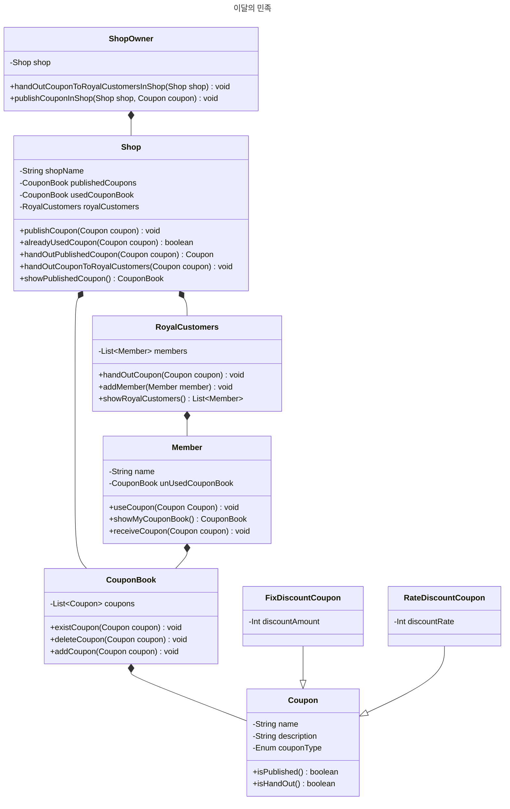
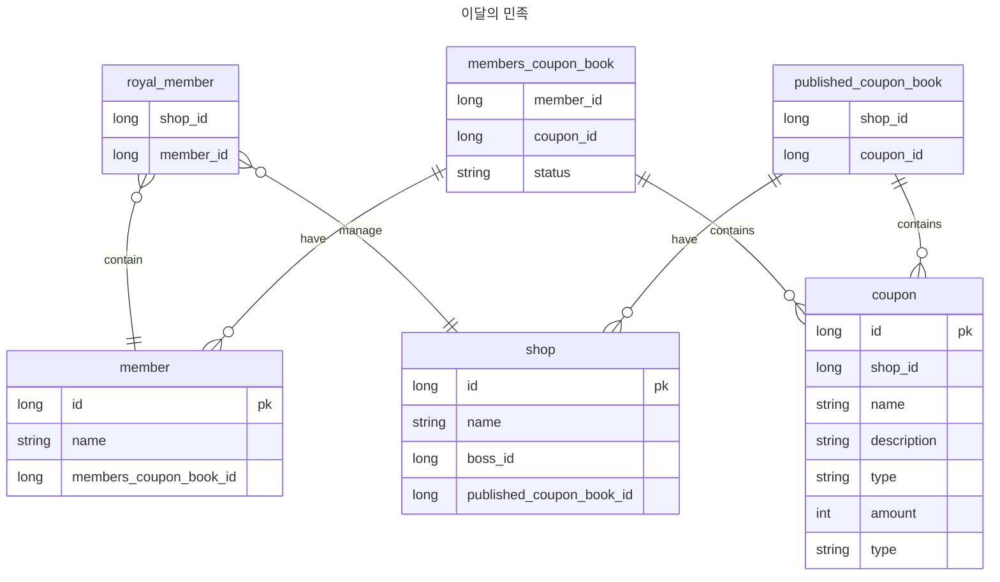

# 1주차 
## 이민의민족 - 쿠폰서비스 
이스트소프트는 최근, 배달서비스를 런칭했습니다. 해당 서비스는 MSA로 나뉘어있고 이 중 쿠폰서버의 아키텍처를 구성해야 한다는 미션을 받았습니다.
팀원들은 각 요구사항을 토대로 도메인 설계를 진행하고 요구사항을 만족해야한다. 

### 요구사항 
1. 이민의 민족 쿠폰은 할인율 쿠폰과 금액 쿠폰 두종류가 존재합니다.
2. ID는 시간대별 순서가 보장되어야합니다.
3. 쿠폰발급의 이벤트는 버튼을 통한 발급, 정기적인 발급 총 두 개입니다.
4. 동일한 쿠폰은 하루에 하나씩만 발급 가능합니다.

## PR 방법
1. 해당 레포지토리를 fork합니다.
2. fork한 레포지토리를 clone합니다.
3. clone한 레포지토리에서 브랜치를 생성합니다. (브랜치 이름은 자유롭게)
4. 해당 브랜치에서 작업을 진행합니다.
5. 작업이 완료되면 PR을 보냅니다. (PR은 각 이름 브랜치로 보내주세요.)

## 설계 과정

### 요구사항 정리

- 쿠폰은 OOO 대상을 할인하기 위한 목적이다.
    - 가게에 진열된 상품 대상
- 회원은 OOO 행동으로 쿠폰을 발급받는다.
    - 가게에 접근해 쿠폰 발급 버튼을 누르는 행동
    - 가게 주인이 가게 쿠폰을 가져갔던 손님들에게 쿠폰을 뿌리는 행동
- 쿠폰의 할인 정책은 OOO 방법을 적용한다.
    - 고정금액을 할인하는 정액제 방법
    - 비율로 할인하는 정률제 방법

### 프로그래밍 요구사항 정리

- 발급받은 쿠폰 식별자는 시간대별로 순서가 보장되어야 한다.

> ID는 시간대별 순서가 보장되도록 고민한 이유는 쿠폰은 유효기간이 존재하고 제약 조건도 많아 사용자의 기억속에 휘발성이 많다고 생각해서이다. 그래서 시간 지역성을 띈다고 생각했고 한 번 조회할 때마다 하나의 블록을 읽어오는 InnonDB의 특성을 잘 살릴 수 있어보였다.

### 도메인 모델링

### 데이터 모델링

